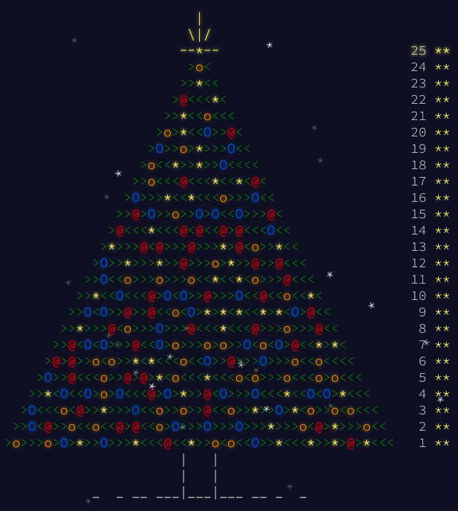

# Advent Of Code

For now, all of it is written in Go. Hopefully in the future, I would like to use others languages.

# Commands

- `cd go/XXXX/dayXX` then `go run dayXX.go`

# Year 2023

| Go                       | Part 1|Part 2 |
|:------------------------:|:-----:|:-----:|
|[day 01](./go/2023/day01/)|&check;|&check;|
|[day 02](./go/2023/day02/)|&check;|&check;|
|[day 03](./go/2023/day03/)|&check;|&check;|

# Year 2022

| Go                       | Part 1 | Part 2 |
|:------------------------:|:------:|:------:|
|[day 01](./go/2022/day01/)|&check;|&check;|
|[day 02](./go/2022/day02/)|&check;|&check;|
|[day 03](./go/2022/day03/)|&check;|&check;|
|[day 04](./go/2022/day04/)|&check;|&check;|
|[day 05](./go/2022/day05/)|&check;|&check;|
|[day 06](./go/2022/day06/)|&check;|&check;|
|[day 07](./go/2022/day07/)|&check;|&check;|
|[day 08](./go/2022/day08/)|&check;|&check;|
|[day 09](./go/2022/day09/)|&check;|&check;|
|[day 10](./go/2022/day10/)|&check;|&check;|
|[day 11](./go/2022/day11/)|&check;|&check;|
|[day 12](./go/2022/day12/)|&check;|&check;|
|[day 13](./go/2022/day13/)|&check;|&check;|
|[day 14](./go/2022/day14/)|&check;|&check;|
|[day 15](./go/2022/day15/)|&check;|&cross;|
|[day 16](./go/2022/day16/)|&cross;|&cross;|

# Year 2015

| Go                       | Part 1 | Part 2 |
|:------------------------:|:------:|:------:|
|[day 01](./go/2015/day01/)|&check;|&check;|
|[day 02](./go/2015/day02/)|&check;|&check;|
|[day 03](./go/2015/day03/)|&check;|&check;|
|[day 04](./go/2015/day04/)|&check;|&check;|
|[day 05](./go/2015/day05/)|&check;|&check;|
|[day 06](./go/2015/day06/)|&check;|&check;|
|[day 07](./go/2015/day07/)|&check;|&check;|
|[day 08](./go/2015/day08/)|&check;|&check;|
|[day 09](./go/2015/day09/)|&check;|&check;|
|[day 10](./go/2015/day10/)|&check;|&check;|
|[day 11](./go/2015/day11/)|&check;|&check;|
|[day 12](./go/2015/day12/)|&check;|&check;|
|[day 13](./go/2015/day13/)|&check;|&check;|
|[day 14](./go/2015/day14/)|&check;|&check;|
|[day 15](./go/2015/day15/)|&check;|&check;|
|[day 16](./go/2015/day16/)|&check;|&check;|
|[day 17](./go/2015/day17/)|&check;|&check;|
|[day 18](./go/2015/day18/)|&check;|&check;|
|[day 19](./go/2015/day19/)|&check;|&check;|
|[day 20](./go/2015/day20/)|&check;|&check;|
|[day 21](./go/2015/day21/)|   *   |   *   |
|[day 22](./go/2015/day22/)|   *   |   *   |
|[day 23](./go/2015/day23/)|&check;|&check;|
|[day 24](./go/2015/day24/)|&check;|&check;|
|[day 25](./go/2015/day25/)|   *   |&check;|

# Notes

- `*` means that the input is directly put in the code. 